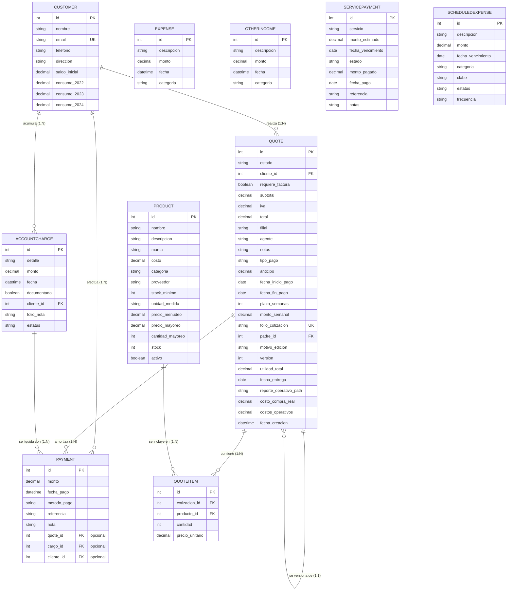

# Análisis Completo del Sistema de Cotizaciones FastAPI

Este documento contiene un análisis detallado de la lógica de negocio, arquitectura y flujo operativo del sistema de cotizaciones, así como los diagramas visuales solicitados para comprender el ciclo de vida del programa y las relaciones entre las tablas de la base de datos.

---

## 1. Análisis de la Lógica del Programa

El sistema está construido con **FastAPI** como framework web de alto rendimiento y **SQLModel** (basado en SQLAlchemy y Pydantic) como ORM para la interacción con la base de datos **SQLite**. La lógica de negocio está organizada en torno a los siguientes módulos clave:

### A. Gestión de Clientes (`Customer`)
*   **Campos Financieros Históricos:** Además de los datos de contacto tradicionales, cada cliente almacena un `saldo_inicial` y campos de consumo anuales históricos (`consumo_2022`, `consumo_2023`, `consumo_2024`).
*   **Cálculo de Deuda Global:** La deuda actual de un cliente no es un campo estático en la base de datos, sino un cálculo en tiempo real ejecutado en el endpoint `/api/v1/payments/active-customers`:
    $$\text{Saldo Global Pendiente} = \text{Saldo Inicial} + \text{Total en Proyectos Aprobados} + \text{Total de Cargos Extra} - \text{Total de Pagos Realizados}$$

### B. Gestión de Catálogo e Inventario (`Product`)
*   **Precios de Venta Flexibles:** Soporta `precio_menudeo` y `precio_mayoreo` (este último se aplica si la cantidad supera la `cantidad_mayoreo`, configurada por defecto en 12 unidades).
*   **Control de Stock y Alertas:** Controla el inventario (`stock`) y el `stock_minimo` para la reposición de existencias.
*   **Descuento de Stock en Tiempo Real:** El stock de los productos **no se descuenta** cuando la cotización se crea en estado *Borrador* o *Enviada*. Solo cuando el estado cambia formalmente a **"Aceptada"** (aprobada por el cliente), el sistema valida el inventario disponible y disminuye las unidades correspondientes (`producto.stock -= item.cantidad`).

### C. Lógica Avanzada de Cotizaciones (`Quote`)
*   **Trazabilidad y Versiones (Árbol de Historial):**
    *   Cuando se realiza una modificación a una cotización existente, el sistema no sobrescribe la anterior.
    *   La cotización original (madre) se marca con `estado = "Sustituida"`.
    *   Se crea una nueva cotización con un `padre_id` que apunta a la original, aumentando el contador de `version` en 1.
    *   **Folio Dinámico:** Si la cotización original tenía folio `C20260001`, la nueva versión heredará el folio base con el sufijo de versión, resultando en `C20260001-V2`.
*   **Contabilidad y Financiamiento:**
    *   **Impuestos:** El sistema calcula el `subtotal` sumando los precios unitarios pactados por las cantidades. Si `requiere_factura` es verdadero, añade automáticamente un 16% de IVA.
    *   **Validación de Anticipos:** Previene errores verificando que el `anticipo` ingresado no sea mayor que el `total` calculado.
    *   **Financiamiento Semanal:** Si el tipo de pago es "Semanal", restringe el `monto_semanal` a un rango de viabilidad financiera estricto (entre **$600** y **$800** MXN).

### D. Cargos Extraordinarios y Notas de Remisión (`AccountCharge`)
*   **Servicios Especiales:** Permite registrar cargos extraordinarios no asociados a productos de inventario (por ejemplo, fletes, servicios técnicos o mano de obra).
*   **Agrupación y Remisión:** Los clientes pueden acumular varios cargos pendientes. El endpoint `/api/v1/payments/remission` permite seleccionar múltiples cargos (`charge_ids`), agruparlos y generar una **Nota de Remisión unificada en PDF**. Al hacerlo, a todos los cargos seleccionados se les asigna el mismo `folio_nota` secuencial (con formato `N2026XXXX`) y su estatus cambia a `"Remisión Emitida"`.

### E. Gestión Multicapa de Pagos (`Payment`)
Un pago en el sistema puede aplicarse bajo tres niveles de prioridad según la necesidad:
1.  **Pago a Cotización (`quote_id`):** Amortiza la deuda de un proyecto/cotización específico.
2.  **Pago a Cargo Extra (`cargo_id`):** Liquidación directa de un servicio o cargo manual.
3.  **Abono Global / Pago Directo (`cliente_id` sin vinculación a cotización o cargo):** Se registra a favor del cliente y el sistema lo aplica de forma cronológica (FIFO) para saldar primero el `saldo_inicial` y luego los cargos más antiguos del Estado de Cuenta.

---

## 2. Diagrama de Flujo del Ciclo de la Cotización

Este diagrama muestra el recorrido que sigue una cotización en el backend desde su registro inicial hasta la entrega final del proyecto y sus pagos asociados.

```mermaid
flowchart TD
    %% Estilos de Nodos
    classDef start_end fill:#3b82f6,stroke:#1d4ed8,stroke-width:2px,color:#fff;
    classDef process fill:#f3f4f6,stroke:#d1d5db,stroke-width:1.5px,color:#374151;
    classDef decision fill:#f59e0b,stroke:#d97706,stroke-width:2px,color:#fff;
    classDef success fill:#10b981,stroke:#047857,stroke-width:2px,color:#fff;
    classDef danger fill:#ef4444,stroke:#b91c1c,stroke-width:2px,color:#fff;

    Start([Inicio: Cliente solicita cotización]) --> InitQuote[Registrar Cotización en la Base de Datos]
    InitQuote --> CheckParent{¿Es edición de una anterior?}
    
    %% Flujo de Edición / Versión
    CheckParent -- Sí --> SetSustituida[Marcar anterior como 'Sustituida']
    SetSustituida --> SetVersion[Incrementar Versión y Generar Folio CXXXX-V#]
    SetVersion --> CalcTotals[Calcular Subtotal, IVA y Utilidad]
    
    %% Flujo de Nueva Cotización
    CheckParent -- No --> GetNewFolio[Generar Folio Secuencial Base CXXXX]
    GetNewFolio --> CalcTotals
    
    %% Validaciones de Negocio
    CalcTotals --> CheckAnticipo{¿Anticipo > Total?}
    CheckAnticipo -- Sí --> ErrorAnticipo[/Error: Anticipo excede el total/] ::: danger
    CheckAnticipo -- No --> CheckSemanal{¿Tipo Pago Semanal?}
    
    CheckSemanal -- Sí --> ValidWeekly{¿Monto entre $600 y $800?}
    ValidWeekly -- No --> ErrorWeekly[/Error: Monto semanal no viable/] ::: danger
    ValidWeekly -- Sí --> SaveDraft[Guardar Cotización en Estado: Borrador / Enviada] ::: process
    CheckSemanal -- No --> SaveDraft
    
    %% Transición de Estados
    SaveDraft --> ActionCustomer{Decisión del Cliente} ::: decision
    ActionCustomer -- Rechaza --> MarkRechazada[Estado: Rechazada] ::: danger
    ActionCustomer -- Solicita Ajustes --> EditQuote[Editar Cotización]
    EditQuote --> Start
    
    ActionCustomer -- Acepta / Aprueba --> ValidateStock{¿Hay Stock suficiente?} ::: decision
    ValidateStock -- No --> ErrorStock[/Error: Stock insuficiente para aceptar/] ::: danger
    
    %% Aprobación y Operación
    ValidateStock -- Sí --> DiscoutStock[Descontar Unidades del Stock de Productos] ::: process
    DiscoutStock --> MarkAprobada[Estado: Aceptada / Aprobada] ::: success
    
    MarkAprobada --> RegisterOperative[Registrar costos reales y subir reporte operativo PDF] ::: process
    RegisterOperative --> MakePayments{¿Registrar pagos / abonos?} ::: decision
    
    MakePayments -- Sí --> CreatePayment[Registrar Pago de Amortización]
    CreatePayment --> CheckDebt{¿Saldo Restante == 0?}
    
    CheckDebt -- No --> KeepPaying[Mantener en Estado de Cuenta Activo]
    KeepPaying --> MakePayments
    
    CheckDebt -- Sí --> MarkLiquidated[Proyecto Liquidado al 100%] ::: success
    MarkLiquidated --> End([Fin del Proceso]) ::: start_end
    MakePayments -- No (Crédito Pendiente) --> End
```

---

## 3. Diagrama de Relación de Tablas (Modelo Entidad-Relación)

A continuación se muestra el mapa completo de la base de datos. Se utiliza la notación Crow's Foot para representar visualmente la cardinalidad (uno a muchos, uno a uno, etc.) entre las tablas gestionadas por SQLModel.



---

## 4. Resumen de Flujos Operativos y Reglas Críticas

### 1. ¿Cómo fluyen los datos al modificar una cotización?
```
[Cotización Original C20260001 (Borrador/Enviada)] 
         │
         ▼  (Usuario solicita cambios en frontend)
[Nueva Cotización C20260001-V2 (Borrador)] ───► Cambia original a "Sustituida"
         │
         ▼  (Cliente acepta)
[Descuenta Stock de Productos] ───► Cambia a estado "Aceptada"
```

### 2. ¿Cómo se liquida la deuda de un cliente en su Estado de Cuenta?
*   Cuando un cliente realiza un pago sin indicar una cotización o cargo específico (**Abono Directo / Global**), la base de datos busca amortizar la deuda en el siguiente orden de prioridad temporal (FIFO):
    1.  **Saldo Inicial:** Saldo histórico registrado al dar de alta al cliente.
    2.  **Cargos manuales más antiguos:** Aquellos registrados mediante `AccountCharge`.
*   Si el pago sí contiene un `quote_id` o `cargo_id`, se asocia y resta directamente al saldo individual del elemento correspondiente, actualizando dinámicamente el progreso financiero de ese proyecto.
